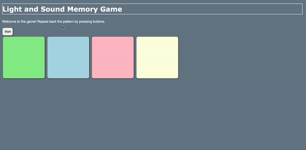

# Pre-work - *Memory Game*

**Memory Game** is a Light & Sound Memory game to apply for CodePath's SITE Program. 

Submitted by: **NAME**

Time spent: **#** hours spent in total

Link to project: (insert your link here, should start with https://glitch.com...)

## Required Functionality

The following **required** functionality is complete:

* [X] Game interface has a heading (h1 tag), a line of body text (p tag), and four buttons that match the demo app
* [X] "Start" button toggles between "Start" and "Stop" when clicked. 
* [X] Game buttons each light up and play a sound when clicked. 
* [X] Computer plays back sequence of clues including sound and visual cue for each button
* [X] Play progresses to the next turn (the user gets the next step in the pattern) after a correct guess. 
* [X] User wins the game after guessing a complete pattern
* [X] User loses the game after an incorrect guess

The following **optional** features are implemented:

* [X] Any HTML page elements (including game buttons) has been styled differently than in the tutorial
* [ ] Buttons use a pitch (frequency) other than the ones in the tutorial
* [ ] More than 4 functional game buttons
* [ ] Playback speeds up on each turn
* [ ] Computer picks a different pattern each time the game is played
* [ ] Player only loses after 3 mistakes (instead of on the first mistake)
* [ ] Game button appearance change goes beyond color (e.g. add an image)
* [ ] Game button sound is more complex than a single tone (e.g. an audio file, a chord, a sequence of multiple tones)
* [ ] User has a limited amount of time to enter their guess on each turn

The following **additional** features are implemented:

- [ ] List anything else that you can get done to improve the app!

## Video Walkthrough (GIF)

If you recorded multiple GIFs for all the implemented features, you can add them here:

## Reflection Questions
1. If you used any outside resources to help complete your submission (websites, books, people, etc) list them here. 
W3schools

2. What was a challenge you encountered in creating this submission (be specific)? How did you overcome it? (recommended 200 - 400 words) 
  
  One initial challenge that I encountered in creating this submission was handling the sounds when the corresponding buttons were pressed. I slowly analyzed the block of code that included the sound synthesis functions and also played around with the values in the frequency map. I believe that this is one of the most integral parts about being a programmer because it is necessary to break down code and try to understand the syntax and what purpose it serves within the whole program or application.

 

3. What questions about web development do you have after completing your submission? (recommended 100 - 300 words) 

The use of the sounds and frequencies in this project was the most appealing to me. In terms of web development, I believe that the utilization of sound is very rare since most of the focus is on the ui and ux and the content of the project. I was wondering if there are any other javascript modules that specifically integrate sound and also the schematics on how it works. It would be interesting to use these features on another small project. 

4. If you had a few more hours to work on this project, what would you spend them doing (for example: refactoring certain functions, adding additional features, etc). Be specific. (recommended 100 - 300 words) 

I would definitely challenge myself by firstly patching the ui and incorporate a crisp design. Specifically, I would change the colors, the background, and make the project more welcoming. I believe that a proper and clean UI really changes the display of the program itself. In this case, I would incorporate a video game theme colorway with the background and the buttons. In addition, I would like to add more buttons and make the game more challenging and unpredictable. Moreover, I believe that adding a timer would have made the game much more interesting and fair. I would also use another framework such as react.js or vue.js. 

## Interview Recording URL Link

[My 5-minute Interview Recording](See github repo)

## License

    Copyright [Tahmidur Rabb]

    Licensed under the Apache License, Version 2.0 (the "License");
    you may not use this file except in compliance with the License.
    You may obtain a copy of the License at

        http://www.apache.org/licenses/LICENSE-2.0

    Unless required by applicable law or agreed to in writing, software
    distributed under the License is distributed on an "AS IS" BASIS,
    WITHOUT WARRANTIES OR CONDITIONS OF ANY KIND, either express or implied.
    See the License for the specific language governing permissions and
    limitations under the License.
